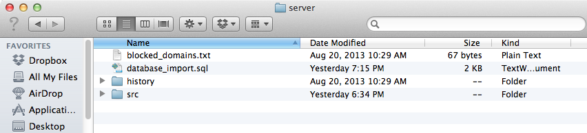
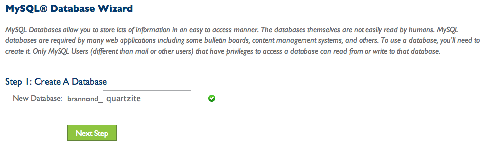
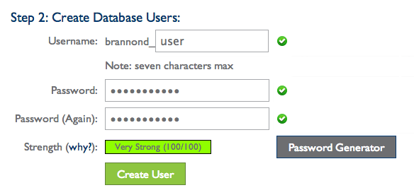
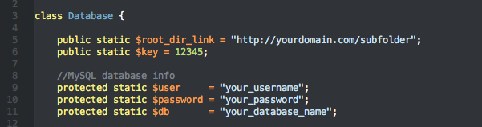
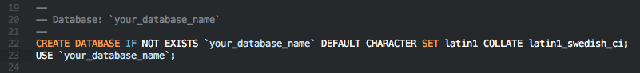
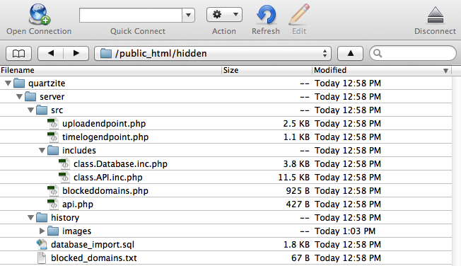

# Quartzite

Quartzite is a Google Chrome browser extension that allows users to auto-log their screenshots and metadata when surfing the web. When Quartzite is enabled it saves a screenshot to your server whenever you go to a new page. It also saves information about any page visit like the domain, url, and the length of time visited, etc... Installing Quartzite on your server is easy, just download this repository and follow the instructions below.

## Setup
This repository is split into three folders:

- server
- extension
- example

It is important to recognize this separation because the Quartzite browser extension only works when it can properly connect to its user's server. It is for this reason that the installation is broken into two steps: 1) [server setup](#Server-setup) and then 2) [extension setup](#extension-setup).

### Server setup
Dynamic web hosting with enabled PHP and MySQL is needed for Quartzite to work. If you do not already have your own domain hosting I recommend a basic hosting plan with [Bluehost](http://bluehost.com).

When you open the "server" directory you should see the following files:



__blocked_domains.txt__ is a list of the domain names for sites that Quartzite doesn't have access to. For security reasons you may want to ban sites like "facebook.com" or "paypal.com" so that Quartzite wont log your private data. More information about privacy protection and the importance of using encryption with Quartzite will be covered in the [Privacy and Encryption](#Privacy-and-Encryption-with-HTTPS/SSL) section of this document.

__database_import.sql__ is an SQL file that contains the pre-structured _quartzite_ database as well as the _metadata_ table. Use it to import the the Quartzite database onto your server with PhpMyAdmin.

The __history__ directory houses the screenshots saved by Quartzite. Inside you will find a folder named _images_. This is where the .png screenshots will be uploaded by default. To change this default upload location edit the value of the `$upload_directory` variable in the [`server/src/uploadendpoint.php`](server/src/uploadendpoint.php) file.

The __src__ directory holds the important php files and webpages that handle the connection between the Quartzite extension and your server. This is where you will edit the files as described below. 

#### Create the database on your server

Firstly, you need to create a dedicated Quartzite database on your server. If you have never created a MySQL database on your server or you need a quick refresher check out your DNS hosting company's tutorials. 

I recommend creating a new database using the MySQL Database Wizard. This helper app should already be installed on your server. If you are using Bluehost it is located in the Database Tools section of your cPanel. Open MySQL Database Wizard now.



You should see a page similar to the one above. You will be prompted to create a new database using your user as a prefix. Prepend it with the desired name of your Quartzite database. I recommend using "quartzite". Be sure to remember the name of your database as you will need it later in this setup.



Next create a user for the database (or add a user if the one you want to use already exists). Remember the username and password for this step as well.  

#### Edit the files

Next open the `class.Database.inc.php` file inside the `src/includes` directory.
Inside you will find the `$root_dir_link`, `$key`, `$user`, `$password`, and `$db` variables. 



The `$root_dir_link` value should be changed to the full url of the directory where you plan on putting your Quartzite server folder. The `$key` variable is a unique passcode. Changing this value to a unique key prohibits other users from submitting images or data to your server. When [setting up the extension](#extension-setup) you will use the same key that you provide here to give your extension permission to communicate with your server. 

Replace the `$user`, `$password`, and `$db` values with the username, password, and database name that you created with MySQL Database Wizard. Edit these variables now.

Next open the `database_import.sql` file inside the `server` folder.



Change all instances of `your_database_name` (lines 20, 22, and 23) to the name of the database you just created using MySQL Database Wizard.
 
#### Import the database

Login to PhpMyAdmin on your server, select your Quartzite database, and then click the "Import" tab on the top navigation bar. Select the "Choose File" button and open the `server/database_import.sql` file. Make sure that the "Character set of the file" is set to "utf-8" (this should already be the default value). Press "Go" to import the database.

**Note**: The default encoding and collation for the Quartzite database are both UTF-8 by default as well. If you don't know what that means, don't worry about it!

#### Upload the files to the server

Now that you have edited the files and installed the database you are ready to upload the files to your server. FTP into your server now and create a new folder inside of your `public_html` (or equivalent) directory. Name this folder whatever you changed the value of the `$root_dir_link` variable inside the `class.Database.inc.php` file to. For instance, if `$root_dir_link = "https://brannondorsey.com/quartzite"` you would name the new folder "quartzite". Now drag the __entire "server" folder__ (not its contents) inside the directory you just made.



The above image is a an example of how the file structure should look once uploaded to the server. 

The screenshot shows my server at `https://brannondorsey.com/hidden`. 
For clarity, the files `server/src/includes/class.Database.inc.php` and `extension/scripts/content_script.js` in this setup read  `$root_dir_link = "https://brannondorsey.com/hidden/quartzite"` and `var rootDirLink = "https://brannondorsey.com/hidden/quartzite"` respectively.

Thats it! Time to setup the extension...

### Extension setup

You are now ready to setup and install the Quartzite browser extension on Google Chrome. 

#### Edit one more file

Before installing the Quartzite extension on Google Chrome you must personalize the "content_script.js" file located at this repository's `extension/scripts/content_script.js` path. Open that file now.


Change these two variables to reflect the [changes you made](#edit-the-files) to the `server/src/includes/class.Database.inc.php` file earlier.

This points your Quartzite extension to the server files you just set up and allows your chrome extension access to post/retrieve data from those server files.

#### Load and pack the extension

Open Google Chrome and open the Extensions page by navigating to Window -> Extensions. Click the "Load unpacked extension" button and select the extension folder. The loaded extension should be automatically enabled. If it isn't check the "enabled" box.

The Quartzite extension should now be sending screenshots and metadata to your browser. If it isn't or you are having another problem with the setup checkout the [Troubleshooting section](#troubleshooting) of this reference.

Read on to learn how to encrypt the data being sent from your Quartzite extension to your server and how to use the built-in API to access your data. 

Enjoy!

## Privacy and Encryption with HTTPS/SSL

Because Quartzite sends your personal browsing data to your web server as you surf the web, it is important to use proper encryption techniques to keep your data private. This section will walk you through installing an SSL Certificate on your server to make this possible. If you already have one installed and are using quartzite through HTTPS, or you intend to remain naive and vulnerable (seriously, if you are using Quartzite you should use SSL encryption) then you may skip this section.

HTTPS/SSL employs [Public-key cryptography](http://en.wikipedia.org/wiki/Public-key_cryptography) to ensure that your data remains safe from people sniffing the network or otherwise monitoring your computer's internet traffic. Using an implementation of [OpenSSL](https://www.openssl.org/) (arguably the most popular and standardized SSL package in use) we will perform the following steps on our server:

1. Generate a Private Key
2. Generate a Certificate Signing Request (CSR)
3. Generate a Self-signed certificate or submit CSR to Certificate Authority to receive a trusted Certificate

For simplicity I am going to follow these steps via the Bluehost cPanel, however if you are running Quartzite on your own self-managed server (e.g. using a linux box at home) [here is a tutorial](https://www.madboa.com/geek/openssl/#cert-self
) for using openSSL from the command line. For more detailed information about installing SSL on a Bluehost server see [this help page](https://my.bluehost.com/cgi/help/473).

Before SSL can be setup on your Bluehost server you must ensure that you have a Dedicated IP (Non-shared). This upgrade can be purchased through Bluehost from their "Addons" page for $3.33/mo. If you choose to use a non-self-signed SSL certificate you I recommend purchasing one from Namecheap for $9.95/yr (more on that below) rather than paying the hefty $49.00/yr from Bluehost.

### Generate a Prive Key

From the cPanel, navigate to the SSL/TLS Manager. From there select the "Generate, view, upload, or delete your private keys" link. Now generate a 2,048 Bit key. Once this is complete return to the SSL Manager page.

### Generate CSR

Now follow the "Generate, view, or delete SSL certificate signing requests" link to create a Certificate Signing Request to submit to a Certificate Authority (or sign yourself as explained below). Be sure to select the key that you just created in the last step as the key to use for this CSR. Now fill out the rest of the personal data making sure to use the same data as is provided from a WHOIS query to your server (not sure what this means? Open a terminal and type `whois http://yourdomain.com`). Once this step is complete navigate back to the SSL Manager page.

### Create Certificate

It is at this point that you will need to choose wether or not to purchase a PositiveSSL certificate from a Certificate Authority generate your own Self-signed certificate. There are pros and cons to both but I strongly recommend purchasing a PositiveSSL certificate:

#### PositiveSSL Pros

- This is the only sure fire way that you can protect yourself from a man-in-the-middle attack when using Quartzite.
- You can use this certificate for your whole domain encrypting everything else that you choose to host on your site.
- This trusted certificate will prevent users who visit your site when using an HTTPS protocol from receiving that terrifying "You are being hacked do not proceed" red-flag page.

#### PositiveSSL Cons

- $9.95/yr
- You feel slightly less like a "rogue self-signed certificate badass" by buying into the common capitalist web of trust implementation most used on the web. (p.s. the [Web of Trust](http://en.wikipedia.org/wiki/Web_of_trust) is actually a fascinating solution to a rather unique problem and is absolutely worth reading up on).

If you choose to use a self-signed certificate you must SSH into your server and then follow [this tutorial](http://www.akadia.com/services/ssh_test_certificate.html) picking up on step three. Otherwise head on over to [Namecheap](https://namecheap.com), to purchase and activate a PositiveSSL certificate __making sure__ to use the CSR that you have already generated on your Bluehost site. Finally, visit the "Generate, view, upload, or delete SSL certificates" link on the SSL Manager page to upload your certificate.

If you are using Bluehost and you do not have root access to your own private server you need to contact Bluehost by phone, chat, or by opening a ticket to install your uploaded certificate. Tell them you need a "High level tech to install a 3rd party SSL certificate on your server" and that you "have uploaded the necessary private key, CSR, and Certificate already".

That's it. Now be safe out there guys and girls.

### Final Privacy Notes

A few more quick notes about privacy when using Quartzite.

1. It is important to note that the default `server/history/images` folder __is publicly web accessible__. I have placed a blank index.html file in that folder so that someone who navigates to that page will not get a default directory listing of every screenshot that has been uploaded via Quartzite but there is nothing stoping someone from viewing/downloading those images if they know the exact URLs. If this is unsettling to you or if you prefer to keep these images __totally__ private I recommend changing the `$upload_dir` variable in the `server/src/uploadendpoint.php` page to a non-web-accessible folder on your server.

2. By default, the Quartzite API (explained below) now requires the inclusion of the `$key` you specified in the server and extension setup instructions to be included in the URL parameters like so: `https://yourdomain.com/quartzite?key=12345`. If you are using HTTPS/SSL this parameter (and every other GET parameter included in the url) __will be__ encrypted. That said, be aware that this may be visible in or stored by your browser, so try and keep these requests and logs away from prying eyes. This privacy method is in an effort to provide some elements of security right off the bat, not to provide a 100% fool-proof method of security. If you prefer more privacy you may re-write the `server/src/api.php` file to fit your needs or remove it from your server altogether.

## API

Now that you have the Quartzite extension up and running you probably want to know how you can use the data you collect with it. Included in the `server/src` folder is an `api.php` file. This file acts as a client-server [REST API](http://en.wikipedia.org/wiki/Representational_state_transfer) that returns valid `JSON` to describe the data in your Quartzite database. You can access this data from anywhere using `GET` parameters in an http request. For example, `https://yourdomain.com/quartzite/server/src/api.php?key=12345&domain=twitter.com&order_by=timestamp&limit=5` returns an array of `JSON` objects that represent the five most recent visits to twitter.com.

Using the API is easy once you learn how it works. 

### <a id="getting-started"></a>Getting Started

#### Formatting a request

The Quarzite database runs on [MySQL](https://en.wikipedia.org/wiki/MySQL) and so the HTTP requests used to return metadata is very similar to forming a MySQL `SELECT` query statement. If you have used MySQL before, think of using the api `GET` parameters as little pieces of a query. For instance, the `limit`, `order_by`, and `flow` (my nickname for MySQL `ORDER BY`'s `DESC` or `ASC`) parameters translate directly into a MySQL statement on your server.

#### <a id="example-request"></a>Example Request
     https://yourdomain.com/subfolder?key=12345&search=wired.com&limit=50
     
The above request would return the 50 newest page visits to GitHub.

#### Notable Parameters

- `search` uses a MySQL FULLTEXT search to find the most relevant results in the database to the parameter's value.
- `order_by` returns results ordered by the column name given as the parameter's value.
- `limit` specifies the number of returned results. If not included as a parameter the default value is `25`. Max value is `250`.
- `page` uses a MySQL `OFFSET` to return the contents of a hypothetical "page" of results in the database. Used most effectively when paired with `limit`.

A full list of all Quartzite API parameters are specified in the [Parameter Reference](#parameter-reference) link to the section below) section of this Documentation.


### Returned JSON

All data returned by the API is wrapped in a `JSON` object named `data`. If there is an error, or no results are found, an `error` object with a corresponding error message will be returned __instead__ of a `data` object. 

Inside the `data` object is an array of objects that are returned as a result of the url parameters that will be outlined shortly.

```json
{
    "data": [
        {
            "id": "1035",
            "timestamp": "2013-08-27T20:57:54-0600",
            "filename": "2013-08-27T20%3A57%3A54-0600.png",
            "title": "JSONLint - The JSON Validator.",
            "domain": "jsonlint.com",
            "url": "http://jsonlint.com/",
            "ip": "50.141.246.246",
            "description": "JSON Lint is a web based validator and reformatter for JSON, a lightweight data-interchange format."
        },
        {
            "id": "1034",
            "timestamp": "2013-08-27T20:53:56-0600",
            "filename": "2013-08-27T20%3A53%3A56-0600.png",
            "title": "Amazon.com: Â The Place Beyond the Pines - 11 x 17 Movie Poster - Style A: Home &amp; Kitchen",
            "domain": "www.amazon.com",
            "url": "http://www.amazon.com/The-Place-Beyond-Pines-Poster/dp/B00BFXV34I",
            "referrer": "https://www.google.com/",
            "ip": "50.141.246.246",
            "description": "Find the biggest selection of products from POSTERS with the lowest prices. Shop online for bedding, furniture, vacuums, decor, storage and more at Amazon.com",
            "keywords": "Â The Place Beyond the Pines - 11 x 17 Movie Poster - Style A,INCLINE ENTERTAINMENT"
        }
    ]
}
```

__Note:__ The `data` object always contains an array of objects even if there is only one result.

The API allows you access to each webpage's:

`id`, `timestamp`, `firstname`, `title`, `domain`, `url`, `length_visited`, `referrer`, `ip`, `forward_from` (if the IP Address was forwarded), `author`, `owner`, `description`, `keywords`, and `copywrite`.

These webpage object properties correspond to the column names in the MySQL database. Each object contains these properties as long as they are not empty. Because `<meta>` tags are optional often many of them are empty.

## Examples

Because the API outputs data using `JSON` the results of an api HTTP request can be loaded into a project written in almost any popular language. I have chosen to provide brief code examples using `PHP`, however, these code snippets outline the basics of loading and using your Quartzite data and easily apply to another language. 

### Using the Data

```php
<?php
$month = "2013-8";
$referrer = "google.com";

$http_request = "http://yourdomain.com/subfoler/server/src/api.php?timestamp=". $month
. "&referrer=" . $referrer;
	
$json_string = file_get_contents($http_request);
$jsonObj = json_decode($json_string);
	
//loop through each user object inside of the "data" array
foreach($jsonObj->data as $webpage){
   //do something with each result inside of here...
   //for example, print some of their info to the browser
   echo "This webpage's domain is " . $webpage->domain . "<br/>";
   echo "This webpage's timetamp is " . $user->timestamp . "<br/>";
   echo "This webpage was focused for is " . $user->length_visited/1000 . "seconds";
   echo "<br/>";
}
?>
```

### Error Handling

Often requests to the api return no results because no webpages were found that met the request's criteria. For this reason it is important to know how to handle the the api `error`. The `JSON` that is returned in this instance is `{"error": "no results found"}`.

Handling `errors` is simple. All that you need to do is check if the `error` property exists in the resulting `JSON` object. If it does execute the code for when an error is present. Otherwise, continue with the program because the request returned at least one webpage object.

```php
<?php 
$month = "2013-8";
$referrer = "google.com";

$http_request = "http://yourdomain.com/subfoler/server/src/api.php?timestamp=". $month
. "&referrer=" . $referrer;
	
$json_string = file_get_contents($http_request);
$jsonObj = json_decode($json_string);
	
//check for an error
if(isset($jsonObj->error)){
	//code for handling the error goes in here...
	//for example, print the error message to the browser
	echo $jsonObj->error;

}else{
	//execute the code for when user objects are returned…
	//for example, list the ids of the resulting users
	foreach($jsonObj->data as $webpage){
		echo "This webpage's url is " . $webpage->url . "<br/>";
	}
}
?>
```
	
## <a id="parameter-reference"></a>Parameter Reference

This section documents in detail all of the api parameters currently available. 

### Column Parameters
Column parameters allow you to query any webpage's data for a specific value where the parameter key is specified to be the webpage's column in our database. Column parameters can be stacked for more specific queries.

Parameter __keys:__ Column name (i.e. `domain`) to perform query on.

Parameter __values:__ 
Desired lookup `string`, `int`, or `float` that corresponds to the column name in the database as specified by the parameter's key.

__Example:__

      http://yourdomain.com/subfolder/server/src/api.php?domain=wired.com&limit=10
      
This example piggybacks off of the [example request](#example-request) used in the [Getting Started](#getting-started) section of this documentation. This request would yield more accurate results if you were looking for webpages where the domain is wired.com. The previous method using the `search` parameter would have given any results that include wired.com somewhere in the website's metadata.

If you were looking for the 10 most recent wired.com visits that came from facebook the http request would look like this:

     http://yourdomain.com/subfolder/server/src/api.php?domain=wired.com&referrer=facebook.com&limit=10

__Notes:__ The column parameter's are overridden if a `search` parameter is specified. 

### Search Parameter
The `search` parameter uses a  MySQL `FULLTEXT` [Match()… Against()…](http://dev.mysql.com/doc/refman/5.5/en/fulltext-search.html#function_match) search to find the most relevant results to the searched string. 

Parameter __key:__ `search`

Parameter __value:__ desired query `string`

__Example:__

	http://yourdomain.com/subfolder/server/src/api.php?search=design

__Notes:__ `search` results are automatically ordered by relevancy, or if relevancy is found to be arbitrary, by `timestamp`. The `order_by` parameter cannot be used when the `search` parameter is specified. More on why below…

Default Match()…Against()… MySQL statements search databases using a 50% similarity threshold. This means that if a searched string appears in more than half of the rows in the database the search will ignore it. Because it is possible that webpages will have similar tags, I have built the api to automatically re-search `IN BOOLEAN MODE` if no results are found in the first try. If results are found in the second search they are ordered by `timestamp`.

### Exact Parameter

The exact parameter is used in conjunction with the column parameters and specifies whether or not their values are queried with relative or exact accuracy. If not included in the url request the `exact` parameter defaults to `false`.

Parameter __key:__ `exact`

Parameter __values:__ `TRUE	` and `FALSE`

__Example:__

	http://yourdomain.com/subfolder/server/src/api.php?length_visited=1000&exact=TRUE&limit=5

This request will limit the returned results to webages whose length_visited is __only__ 1 second. If the `exact` parameter was not specified, or was set to `FALSE`, the same request could also return webpages whose length_visited have a trailing 1 second (i.e. 11 seconds, 131 seconds, etc…). including `exact=true` parameter in an api http request is equivalent to a `MySQL` `LIKE` statement.
	
__Notes:__ `exact`'s values are case insensitive.

### Exclude Parameter

The exclude parameter is used in conjunction with the column parameters to exclude one or more specific webpage's from a query.


Parameter __key:__ `exclude`

Parameter __values:__ a comma-delimited list of excluded webpage's `id`'s

__Example:__

	http://yourdomain.com/subfolder/server/src/api.php?domain=brannondorsey.com&exclude=5,137,1489&limit=50

This example will return the first 50 users other than numbers `5`, `137`, and `1489` whose domain includes brannondorsey.com. 

### Order By Parameter

This parameter is used with the column parameters to sort the returned users by the specified value. If `order_by` is not specified its value defaults to `timestamp`. Order by cannot be used when the `search` parameter is specified.

Parameter __key:__ `order_by`

Parameter __value:__ Column name (i.e. `length_visited`) to order by

__Example:__

	http://yourdomain.com/subfolder/server/src/api.php?domain=buzzfeed.com&order_by=length_visited&limit=15

This request returns the 15 longest visited buzzfeed webpages.

### Flow Parameter

This parameter specifies the MySQL `ASC` and `DESC` options that follow the `ORDER BY` statement. If `flow` is not specified it defaults to `DESC`.

Parameter __key:__ `flow`

Parameter __value:__ `ASC` or `DESC`

__Example:__

	http://yourdomain.com/subfolder/server/src/api.php?keywords=virtual%20reality&order_by=title&flow=ASC
	
This request specifies that the results should be ordered in an `ASC` fashion. It would return webpages whose keywords include "virtual reality" in a reverse alphabetical order by title.
		
__Notes:__ `flow`'s values are case insensitive.

### Limit Parameter

The `limit` parameter works similarly to MySQL `LIMIT`. It specifies the max number of users to be returned. The default value, if unspecified is `25`. The max value of results that can be returned in one request is `250`.

Parameter __key:__ `limit`

Parameter __value:__ `int` between `1-250`

__Example:__

	http://yourdomain.com/subfolder/server/src/api.php?referrer=amazon.com&limit=5

Returns the 5 most recent webpages referred from amazon.com.

	
### Page Parameter

The page parameter is used to keep track of what set (or page) of results are returned. This is similar to the [MySQL OFFSET statement](http://dev.mysql.com/doc/refman/5.0/en/select.html). If not specified the page value will default to `1`.

Parameter __key:__ `page`

Parameter __value:__ `int` greater than `0`

__EXAMPLE:__ 

	http://yourdomain.com/subfolder/server/src/api.php?search=zombie&limit=7&page=3&order_by=length_visited&flow=asc	
This request will return the 3rd "page" of `search` results. 

For instance, in the absurd example that all webpages had "zombie" as a keyword, setting `page=1` would return webpages with id's `1-7`, setting `page=2` would yield `8-14`, etc…

__Note:__ The MySQL `OFFSET` is calculated server side by multiplying the value of `limit` by the value of `page` minus one. 

### Count Only Parameter

The `count only` parameter differs from all of the other Indexd API parameters as it __does not__ return an array of user objects. Instead, it returns a single object as the first element in the `data` array. This object has only one property, `count`, where the corresponding `int` value describes the number of results returned by the rest of the url parameters. If the `count_only` parameter is not specified the default value is `FALSE`. When `count_only` is set to `TRUE` the request will __only__ evaluate and return the number of results found by the rest of the url parameters and the request will not return any user data.

Parameter __key:__ `count_only`

Parameter __values:__ `	TRUE` or `FALSE`

__EXAMPLE:__

     //request
     http://yourdomain.com/subfolder/server/src/api.php?domain=google.com&count_only=true
     
     //returns
     {
      "data":[
        {
        "count":"701"
        }]
     }
     
This request returns the number of webpages that have "google.com" as the domain. The count value is returned as __a `string`__.

__Note:__ The value of `count_only` is case insensitive.


## Troubleshooting

Permissions on server are correct?

## License and Credit

The Quartzite project is developed and maintained by [Brannon Dorsey](http://brannondorsey.com) and is published under the [MIT License](license.txt). If you notice any bugs, have any questions, or would like to help me with development please submit an issue or pull request, write about it on our wiki, or [contact me](mailto:brannon@brannondorsey.com).
